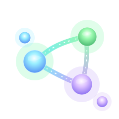

<a id="readme-top"></a>

<!-- [![Contributors][contributors-shield]][contributors-url] -->
[![Forks][forks-shield]][forks-url]
[![Stargazers][stars-shield]][stars-url]
[![Issues][issues-shield]][issues-url]
[![MIT License][license-shield]][license-url]
<!-- [![LinkedIn][linkedin-shield]][linkedin-url] -->


<!-- PROJECT LOGO -->
<br />
<div align="center">
  <a href="https://github.com/podcast-geeker/podcast-geeker">
    
  </a>

  <h3 align="center">Podcast Geeker</h3>

  <p align="center">
    An open source, privacy-focused Podcast Geeker!
    <br /><strong></strong>
    <br />
    <a href="https://github.com/podcast-geeker/podcast-geeker"></a>
    <br />
    <br />
    <a href="docs/0-START-HERE/index.md">📚 Get Started</a>
    ·
    <a href="docs/3-USER-GUIDE/index.md">📖 User Guide</a>
    ·
    <a href="docs/2-CORE-CONCEPTS/index.md">✨ Features</a>
    ·
    <a href="docs/1-INSTALLATION/index.md">🚀 Deploy</a>
  </p>
</div>


## A private, multi-model, 100% local, full-featured alternative to Notebook LM
## Enhanced with Advanced Agentic RAG Capabilities


In a world dominated by Artificial Intelligence, having the ability to think 🧠 and acquire new knowledge 💡, is a skill that should not be a privilege for a few, nor restricted to a single provider.

**Podcast Geeker empowers you to:**
- 🔒 **Control your data** - Keep your research private and secure
- 🤖 **Choose your AI models** - Support for 16+ providers including OpenAI, Anthropic, Ollama, LM Studio, and more
- 📚 **Organize multi-modal content** - PDFs, videos, audio, web pages, and more
- 🎙️ **Generate professional podcasts** - Advanced multi-speaker podcast generation
- 🔍 **Search intelligently** - Advanced Agentic RAG with hierarchical indexing, query rewriting, and self-correction
- 💬 **Chat with context** - AI conversations powered by your research with conversation memory
- 🧠 **Smarter retrieval** - Parent/Child chunking, query analysis, and automatic relevance evaluation
- 🌐 **Multi-language UI** - English, Portuguese, Chinese (Simplified & Traditional), Japanese, and Russian support


---


**Why Choose Podcast Geeker?**
- 🔒 **Privacy First**: Your sensitive research stays completely private
- 💰 **Cost Control**: Choose cheaper AI providers or run locally with Ollama
- 🧠 **Smarter Search**: Advanced Agentic RAG with hierarchical indexing and query understanding
- 🔍 **Better Accuracy**: Self-correction mechanisms ensure relevant results
- 🎙️ **Better Podcasts**: Full script control and multi-speaker flexibility vs limited 2-speaker deep-dive format
- 🔧 **Unlimited Customization**: Modify, extend, and integrate as needed
- 🌐 **No Vendor Lock-in**: Switch providers, deploy anywhere, own your data

### Built With

[![Python][Python]][Python-url] [![Next.js][Next.js]][Next-url] [![React][React]][React-url] [![SurrealDB][SurrealDB]][SurrealDB-url] [![LangChain][LangChain]][LangChain-url]

## 🚀 Quick Start (2 Minutes)

### Prerequisites
- [Docker Desktop](https://www.docker.com/products/docker-desktop/) installed
- That's it! (API keys configured later in the UI)

### Step 1: Get docker-compose.yml

**Option A:** Download directly
```bash
curl -o docker-compose.yml https://raw.githubusercontent.com/lfnovo/open-notebook/main/docker-compose.yml
```

**Option B:** Create the file manually
Copy this into a new file called `docker-compose.yml`:

```yaml
services:
  surrealdb:
    image: surrealdb/surrealdb:v2
    command: start --log info --user root --pass root rocksdb:/mydata/mydatabase.db
    user: root
    ports:
      - "8000:8000"
    volumes:
      - ./surreal_data:/mydata
    restart: always

  open_notebook:
    image: podcast-geeker:v1:v1-latest
    ports:
      - "8502:8502"
      - "5055:5055"
    environment:
      - OPEN_NOTEBOOK_ENCRYPTION_KEY=change-me-to-a-secret-string
      - SURREAL_URL=ws://surrealdb:8000/rpc
      - SURREAL_USER=root
      - SURREAL_PASSWORD=root
    volumes:
      - ./notebook_data:/app/data
    depends_on:
      - surrealdb
    restart: always
```

### Step 2: Set Your Encryption Key
Edit `docker-compose.yml` and change this line:
```yaml
- OPEN_NOTEBOOK_ENCRYPTION_KEY=change-me-to-a-secret-string
```
to any secret value (e.g., `my-super-secret-key-123`)

### Step 3: Start Services
```bash
docker compose up -d
```

Wait 15-20 seconds, then open: **http://localhost:8502**

### Step 4: Configure AI Provider
1. Go to **Settings** → **API Keys**
2. Click **Add Credential**
3. Choose your provider (OpenAI, Anthropic, Google, etc.)
4. Paste your API key and click **Save**
5. Click **Test Connection** → **Discover Models** → **Register Models**

Done! You're ready to create your first notebook.

> **Need an API key?** Get one from:
> [OpenAI](https://platform.openai.com/api-keys) · [Anthropic](https://console.anthropic.com/) · [Google](https://aistudio.google.com/) · [Groq](https://console.groq.com/) (free tier)

> **Want free local AI?** See [examples/docker-compose-ollama.yml](examples/) for Ollama setup

---

### 📚 More Installation Options

- **[With Ollama (Free Local AI)](examples/docker-compose-ollama.yml)** - Run models locally without API costs
- **[From Source (Developers)](docs/1-INSTALLATION/from-source.md)** - For development and contributions
- **[Complete Installation Guide](docs/1-INSTALLATION/index.md)** - All deployment scenarios

---

### 📖 Need Help?

- **🤖 AI Installation Assistant**: [CustomGPT to help you install](https://chatgpt.com/g/g-68776e2765b48191bd1bae3f30212631-open-notebook-installation-assistant)
- **🆘 Troubleshooting**: [5-minute troubleshooting guide](docs/6-TROUBLESHOOTING/quick-fixes.md)
- **💬 Community Support**: [Discord Server](https://discord.gg/37XJPXfz2w)
- **🐛 Report Issues**: [GitHub Issues](https://github.com/podcast-geeker/podcast-geeker/issues)

---


*Supports LM Studio and any OpenAI-compatible endpoint

## ✨ Key Features

### Core Capabilities
- **🔒 Privacy-First**: Your data stays under your control - no cloud dependencies
- **🎯 Multi-Notebook Organization**: Manage multiple research projects seamlessly
- **📚 Universal Content Support**: PDFs, videos, audio, web pages, Office docs, and more
- **🤖 Multi-Model AI Support**: 16+ providers including OpenAI, Anthropic, Ollama, Google, LM Studio, and more
- **🎙️ Professional Podcast Generation**: Advanced multi-speaker podcasts with Episode Profiles
- **🔍 Advanced Agentic RAG**: Intelligent search with hierarchical indexing, query rewriting, and self-correction
- **💬 Context-Aware Chat**: AI conversations powered by your research materials with conversation memory
- **📝 AI-Assisted Notes**: Generate insights or write notes manually

### Advanced RAG Features
- **🧠 Hierarchical Indexing**: Parent/Child chunking for better context and precision
- **🔄 Query Understanding**: Automatic query rewriting and clarification for ambiguous questions
- **✨ Self-Correction**: Automatic retry with refined queries when initial results are insufficient
- **💭 Conversation Memory**: Ask mode maintains context across multiple questions
- **🖼️ Multi-modal Enhancement**: Optional RAG-Anything integration for images, tables, and equations (PDF)

### Additional Features
- **⚡ Reasoning Model Support**: Full support for thinking models like DeepSeek-R1 and Qwen3
- **🔧 Content Transformations**: Powerful customizable actions to summarize and extract insights
- **🌐 Comprehensive REST API**: Full programmatic access for custom integrations [](http://localhost:5055/docs)
- **🔐 Optional Password Protection**: Secure public deployments with authentication
- **📊 Fine-Grained Context Control**: Choose exactly what to share with AI models
- **📎 Citations**: Get answers with proper source citations and context

)

## 📚 Documentation

### Getting Started
- **[📖 Introduction](docs/0-START-HERE/index.md)** - Learn what Podcast Geeker offers
- **[⚡ Quick Start](docs/0-START-HERE/quick-start.md)** - Get up and running in 5 minutes
- **[🔧 Installation](docs/1-INSTALLATION/index.md)** - Comprehensive setup guide
- **[🎯 Your First Notebook](docs/0-START-HERE/first-notebook.md)** - Step-by-step tutorial

### User Guide
- **[📱 Interface Overview](docs/3-USER-GUIDE/interface-overview.md)** - Understanding the layout
- **[📚 Notebooks](docs/3-USER-GUIDE/notebooks.md)** - Organizing your research
- **[📄 Sources](docs/3-USER-GUIDE/sources.md)** - Managing content types
- **[📝 Notes](docs/3-USER-GUIDE/notes.md)** - Creating and managing notes
- **[💬 Chat](docs/3-USER-GUIDE/chat.md)** - AI conversations
- **[🔍 Search](docs/3-USER-GUIDE/search.md)** - Finding information

### Advanced Topics
- **[🎙️ Podcast Generation](docs/2-CORE-CONCEPTS/podcasts.md)** - Create professional podcasts
- **[🔧 Content Transformations](docs/2-CORE-CONCEPTS/transformations.md)** - Customize content processing
- **[🤖 AI Models](docs/4-AI-PROVIDERS/index.md)** - AI model configuration
- **[🔌 MCP Integration](docs/5-CONFIGURATION/mcp-integration.md)** - Connect with Claude Desktop, VS Code and other MCP clients
- **[🔧 REST API Reference](docs/7-DEVELOPMENT/api-reference.md)** - Complete API documentation
- **[🔐 Security](docs/5-CONFIGURATION/security.md)** - Password protection and privacy
- **[🚀 Deployment](docs/1-INSTALLATION/index.md)** - Complete deployment guides for all scenarios

<p align="right">(<a href="#readme-top">back to top</a>)</p>

## 🗺️ Roadmap

### Recently Completed ✅
- **Advanced Agentic RAG**: Hierarchical indexing, query rewriting, self-correction, conversation memory
- **Multi-Modal Support**: Optional RAG-Anything integration for images, tables, and equations
- **Intelligent Query Processing**: Automatic clarification and reformulation of ambiguous queries
- **Next.js Frontend**: Modern React-based frontend with improved performance
- **Comprehensive REST API**: Full programmatic access to all functionality
- **Multi-Model Support**: 16+ AI providers including OpenAI, Anthropic, Ollama, LM Studio
- **Advanced Podcast Generator**: Professional multi-speaker podcasts with Episode Profiles
- **Content Transformations**: Powerful customizable actions for content processing
- **Enhanced Citations**: Improved layout and finer control for source citations with parent/child context
- **Multiple Chat Sessions**: Manage different conversations within notebooks

### Upcoming Features
- **RAG Evaluation Framework**: Comprehensive benchmarking for retrieval quality
- **Hybrid Search**: Combine vector search with BM25 keyword matching
- **Cross-Encoder Reranking**: Improve result ranking with neural rerankers
- **Graph-Based RAG**: Leverage SurrealDB's graph capabilities for relationship-aware retrieval
- **Live Front-End Updates**: Real-time UI updates for smoother experience
- **Async Processing**: Faster UI through asynchronous content processing
- **Cross-Notebook Sources**: Reuse research materials across projects
- **Bookmark Integration**: Connect with your favorite bookmarking apps

See the [open issues](https://github.com/podcast-geeker/podcast-geeker/issues) for a full list of proposed features and known issues.

<p align="right">(<a href="#readme-top">back to top</a>)</p>


## 📄 License

Podcast Geeker is MIT licensed. See the [LICENSE](LICENSE) file for details.

---

## 🙏 Acknowledgments

Podcast Geeker is built upon and inspired by excellent open-source projects. See our complete [ACKNOWLEDGMENTS.md](ACKNOWLEDGMENTS.md) for detailed attributions.

### Core Project
This project is a fork and enhancement of **[Open Notebook](https://github.com/lfnovo/open-notebook)** by [@lfnovo](https://github.com/lfnovo). We're grateful for the solid foundation and architecture that made these enhancements possible.

### RAG Enhancement Technologies
Our advanced RAG capabilities are inspired by and adapted from:

- **[agentic-rag-for-dummies](https://github.com/GiovanniPasq/agentic-rag-for-dummies)** (MIT License)  
  Provides the foundation for hierarchical indexing, query rewriting, and self-correction mechanisms. We've adapted these Agentic RAG strategies to work with our LangGraph + SurrealDB architecture.

- **[RAG-Anything](https://github.com/HKUDS/RAG-Anything)** (MIT License)  
  Enables multi-modal content understanding for PDFs, including images, tables, and equations. Integrated as an optional enhancement layer for advanced document processing.

### AI Infrastructure
- **[Esperanto](https://github.com/lfnovo/esperanto)** - Multi-provider AI abstraction layer supporting 16+ AI providers
- **[LangChain](https://github.com/langchain-ai/langchain)** & **[LangGraph](https://github.com/langchain-ai/langgraph)** - Workflow orchestration and state management
- **[SurrealDB](https://surrealdb.com/)** - Graph database with built-in vector search

All third-party licenses are preserved and respected. See [ACKNOWLEDGMENTS.md](ACKNOWLEDGMENTS.md) for complete details and individual project repositories for their full license terms.

### Academic Context
This project is part of **CDS547 - Large Language Models** course at the **University of British Columbia** (Winter Term 2, 2024/2025), exploring state-of-the-art RAG techniques in a real-world application.

---

**Community Support**:
- 💬 [Discord Server](https://discord.gg/37XJPXfz2w) - Get help, share ideas, and connect with users
- 🐛 [GitHub Issues](https://github.com/lfnovo/open-notebook/issues) - Report bugs and request features
- 🌐 [Website](https://www.open-notebook.ai) - Learn more about the project

<p align="right">(<a href="#readme-top">back to top</a>)</p>


<!-- MARKDOWN LINKS & IMAGES -->
<!-- https://www.markdownguide.org/basic-syntax/#reference-style-links -->
[contributors-shield]: https://img.shields.io/github/contributors/lfnovo/open-notebook.svg?style=for-the-badge
[contributors-url]: https://github.com/lfnovo/open-notebook/graphs/contributors
[forks-shield]: https://img.shields.io/github/forks/lfnovo/open-notebook.svg?style=for-the-badge
[forks-url]: https://github.com/lfnovo/open-notebook/network/members
[stars-shield]: https://img.shields.io/github/stars/lfnovo/open-notebook.svg?style=for-the-badge
[stars-url]: https://github.com/lfnovo/open-notebook/stargazers
[issues-shield]: https://img.shields.io/github/issues/lfnovo/open-notebook.svg?style=for-the-badge
[issues-url]: https://github.com/lfnovo/open-notebook/issues
[license-shield]: https://img.shields.io/github/license/lfnovo/open-notebook.svg?style=for-the-badge
[license-url]: https://github.com/lfnovo/open-notebook/blob/master/LICENSE.txt
[linkedin-shield]: https://img.shields.io/badge/-LinkedIn-black.svg?style=for-the-badge&logo=linkedin&colorB=555
[linkedin-url]: https://linkedin.com/in/lfnovo
[product-screenshot]: images/screenshot.png
[Next.js]: https://img.shields.io/badge/Next.js-000000?style=for-the-badge&logo=next.js&logoColor=white
[Next-url]: https://nextjs.org/
[React]: https://img.shields.io/badge/React-61DAFB?style=for-the-badge&logo=react&logoColor=black
[React-url]: https://reactjs.org/
[Python]: https://img.shields.io/badge/Python-3776AB?style=for-the-badge&logo=python&logoColor=white
[Python-url]: https://www.python.org/
[LangChain]: https://img.shields.io/badge/LangChain-3A3A3A?style=for-the-badge&logo=chainlink&logoColor=white
[LangChain-url]: https://www.langchain.com/
[SurrealDB]: https://img.shields.io/badge/SurrealDB-FF5E00?style=for-the-badge&logo=databricks&logoColor=white
[SurrealDB-url]: https://surrealdb.com/
